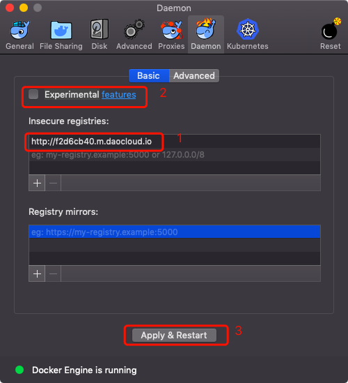

# docker

> 参考资料
>
> + [Docker 入门教程](http://www.ruanyifeng.com/blog/2018/02/docker-tutorial.html) 

## 介绍

### 环境配置问题

+ 问题

  软件开发结束后，能在1台机器上运行，不代表能在其他机器上运行，原因是由运行环境造成的

  有人提出能不能将软件带环境安装

+ 虚拟机方案

  虚拟机是解决上述问题的1种方案，它就是在机器上安装虚拟机，在虚拟机中运行软件

  但是该方案存在如下缺点：

  + 资源占用多

    安装虚拟机需要为虚拟机分配内存和磁盘，可能1个需要1MB内存的程序，虚拟机的运行占用了100MB

  + 冗余步骤多

    有一些系统级别的操作跟运行程序并没有什么关系，但是无法跳过，比如用户登录

  + 系统启动慢

    虚拟机系统开机需要几分钟

+ Linux容器

  用于虚拟机的几个缺点，Linux发展出另外一种虚拟化技术：Linux容器

  **Linux 容器不是模拟一个完整的操作系统，而是对进程进行隔离，**在正常进程的外面套了一个[保护层](https://opensource.com/article/18/1/history-low-level-container-runtimes)。对于容器里面的进程来说，它接触到的各种资源都是虚拟的，从而实现与底层系统的隔离。

  由于容器是进程级别的，相比虚拟机有很多优势：

  + 启动快
  + 占用资源少
  + 体积小

### Docker是什么

**Docker 属于 Linux 容器的一种封装，提供简单易用的容器使用接口。**

Docker 将应用程序与该程序的依赖，打包在一个文件里面。运行这个文件，就会生成一个虚拟容器。程序在这个虚拟容器里运行，就好像在真实的物理机上运行一样。有了 Docker，就不用担心环境问题。

Docker还可以进行版本管理、复制、分享、修改，就像管理普通的代码一样。

### 用途

Docker 的主要用途，目前有三大类。

+ **提供一次性的环境。**比如，本地测试他人的软件、持续集成的时候提供单元测试和构建的环境。

+ **提供弹性的云服务。**因为 Docker 容器可以随开随关，很适合动态扩容和缩容。

+ **组建微服务架构。**通过多个容器，一台机器可以跑多个服务，因此在本机就可以模拟出微服务架构。

## 安装

### 版本

docker分为社区版(CE)和企业版(EE)，企业版中包含一些收费项目，个人一般用不到，我们使用社区版

### 安装文档

如下两个页面中均有各个系统安装docker的教程，安装出现问题时自己查看相关文档

+ [安装 Docker](https://yeasy.gitbooks.io/docker_practice/install/)
+ [Docker 入门教程](http://www.ruanyifeng.com/blog/2018/02/docker-tutorial.html) 

### 安装记录

#### MAC

使用homebrew安装

```shell
$ brew cask install docker
```

#### Centos

按顺序执行如下命令

```shell
# 卸载老版本docker
$ sudo yum remove docker \
                  docker-client \
                  docker-client-latest \
                  docker-common \
                  docker-latest \
                  docker-latest-logrotate \
                  docker-logrotate \
                  docker-selinux \
                  docker-engine-selinux \
                  docker-engine
# 安装需要的依赖
$ sudo yum install -y yum-utils \
           device-mapper-persistent-data \
           lvm2
# 添加软件源
$ sudo yum-config-manager \
    --add-repo \
    https://mirrors.ustc.edu.cn/docker-ce/linux/centos/docker-ce.repo
# 更新软件源缓存
$ sudo yum makecache fast
# 安装docker
$ sudo yum install docker-ce
# 使能docker
$ sudo systemctl enable docker
# 启动docker
$ sudo systemctl start docker
# 将当前用户添加到docker组
$ sudo usermod -aG docker $USER
```

### 测试

接下来执行如下命令测试是否安装成功

```shell
$ docker run hello-world
```

一般来说会报如下错误

```shell
docker: Error response from daemon: Get https://registry-1.docker.io/v2/: net/http: request canceled while waiting for connection (Client.Timeout exceeded while awaiting headers).
```

这是因为docker的仓库源出现问题了，我们添加1个国内仓库即可

+ centos

  > 参见[解决 docker: Error response from daemon: ... : net/http: TLS handshake timeout.](https://www.cnblogs.com/qq952693358/p/6406189.html) 

  按顺序执行如下命令

  ```shell
  # 更换仓库
  $ echo "DOCKER_OPTS=\"\$DOCKER_OPTS --registry-mirror=http://f2d6cb40.m.daocloud.io\"" | sudo tee -a /etc/default/docker
  # 重启docker
  $ sudo service docker restart
  ```

+ mac

  > 参见[docker 出现 Error response from daemon](https://blog.csdn.net/zhengdesheng19930211/article/details/78432646/) 

  点击状态栏的docker图标 → Preferences → Daemon

  在`insecure-registries`一栏中填入`http://f2d6cb40.m.daocloud.io`，**勾选再取消**`Experimental`，重启；如下图：

   


然后重新进行测试就没问题了

### 启动、停止

+ centos

  ```shell
  $ sudo systemctl start docker
  # 或
  $ sudo service docker start
  ```

+ Mac

  界面中操作

## image文件

### 介绍

+ Docker 把应用程序及其依赖，打包在 image 文件里面
+ Docker通过image文件，可以生成多个同时运行的docker容器，docker容器也是文件
+ image文件一般基于别人的image文件加工而成
+ 制作好的image文件一般会上传到网上仓库，如官方仓库 [Docker Hub](https://hub.docker.com/) 

### 仓库

+ insecure-registries

  用于添加私人仓库

+ registry-mirrors

  用于添加镜像仓库，添加1个即可

  如：

  + 国内镜像：http://f2d6cb40.m.daocloud.io
  + 官方镜像：https://registry.docker-cn.com

### 使用image文件

```shell
# 列出本机所有image文件
$ docker image ls
# 删除 image 文件
$ docker image rm [imageName]
# 列出本机的image文件
$ docker image ls
# [拉取并]运行image文件
$ docker run hello-world
# docker中运行ubuntu
$ docker run -it ubuntu bash
# 列出本机正在运行的容器
$ docker container ls
# 列出本机所有容器，包括终止运行的容器
$ docker container ls -a
# 结束运行指定 containID 的容器
$ docker container kill [containID]
# 删除指定 containID 的容器文件
$ docker container rm [containerID]
```

### 制作image文件


## 命令

> [官方文档](https://docs.docker.com/engine/reference/commandline/cli/)中有所有命令的使用说明
>
> 对于一些不好理解的命令在下面进行说明

### docker run

+ 格式

  ```shell
  $ docker run [OPTIONS] IMAGE [COMMAND] [ARG...]
  ```

+ 功能

  在新容器中运行image文件

+ 参数

  + OPTIONS

    |        参数        |                             说明                             |
    | :----------------: | :----------------------------------------------------------: |
    | --interactive , -i | 与容器内部建立1个交互式连接，没有该参数，用户输入无法传入容器<br />可执行`docker container run -i ubuntu bash`进行测试 |
    |     --tty , -t     | 连接到容器里的终端<br />可执行`docker container run -t ubuntu bash`进行测试 |

### docker container

+ docker container run

  与`docker run`命令完全相同


