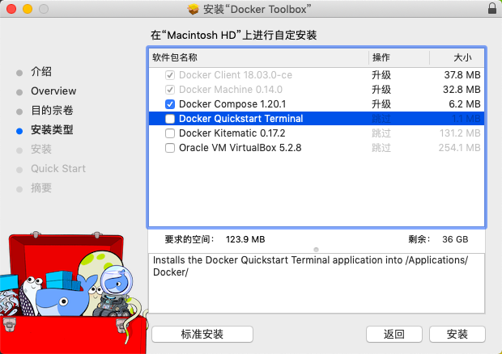
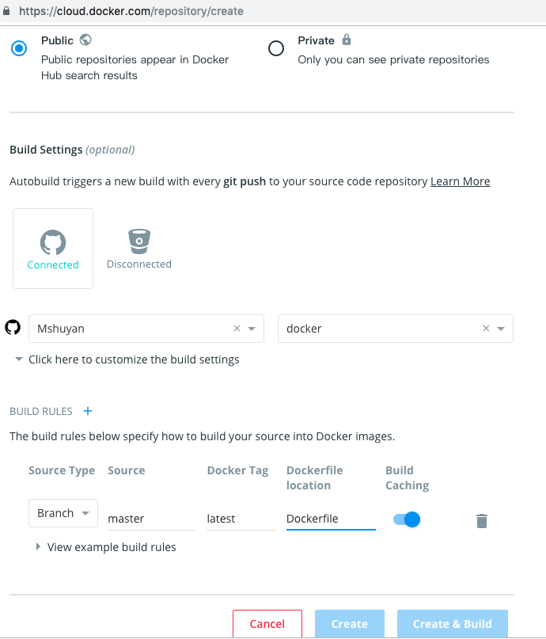
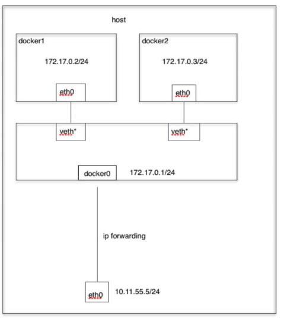

# docker

> 参考资料
>
> + [Docker 入门教程](http://www.ruanyifeng.com/blog/2018/02/docker-tutorial.html) 

## 介绍

### 环境配置问题

+ 问题

  软件开发结束后，能在1台机器上运行，不代表能在其他机器上运行，原因是由运行环境造成的

  有人提出能不能将软件带环境安装

+ 虚拟机方案

  虚拟机是解决上述问题的1种方案，它就是在机器上安装虚拟机，在虚拟机中运行软件

  但是该方案存在如下缺点：

  + 资源占用多

    安装虚拟机需要为虚拟机分配内存和磁盘，可能1个需要1MB内存的程序，虚拟机的运行占用了100MB

  + 冗余步骤多

    有一些系统级别的操作跟运行程序并没有什么关系，但是无法跳过，比如用户登录

  + 系统启动慢

    虚拟机系统开机需要几分钟

+ Linux容器

  用于虚拟机的几个缺点，Linux发展出另外一种虚拟化技术：Linux容器

  **Linux 容器不是模拟一个完整的操作系统，而是对进程进行隔离，**在正常进程的外面套了一个[保护层](https://opensource.com/article/18/1/history-low-level-container-runtimes)。对于容器里面的进程来说，它接触到的各种资源都是虚拟的，从而实现与底层系统的隔离。

  由于容器是进程级别的，相比虚拟机有很多优势：

  + 启动快
  + 占用资源少
  + 体积小

### Docker是什么

**Docker 属于 Linux 容器的一种封装，提供简单易用的容器使用接口。**

Docker 将应用程序与该程序的依赖，打包在一个文件里面。运行这个文件，就会生成一个虚拟容器。程序在这个虚拟容器里运行，就好像在真实的物理机上运行一样。有了 Docker，就不用担心环境问题。

Docker还可以进行版本管理、复制、分享、修改，就像管理普通的代码一样。

### 用途

Docker 的主要用途，目前有三大类。

+ **提供一次性的环境。**比如，本地测试他人的软件、持续集成的时候提供单元测试和构建的环境。

+ **提供弹性的云服务。**因为 Docker 容器可以随开随关，很适合动态扩容和缩容。

+ **组建微服务架构。**通过多个容器，一台机器可以跑多个服务，因此在本机就可以模拟出微服务架构。

## 安装

### 版本

docker分为社区版(CE)和企业版(EE)，企业版中包含一些收费项目，个人一般用不到，我们使用社区版

### 安装文档

如下两个页面中均有各个系统安装docker的教程，安装出现问题时自己查看相关文档

+ [安装 Docker](https://yeasy.gitbooks.io/docker_practice/install/)
+ [Docker 入门教程](http://www.ruanyifeng.com/blog/2018/02/docker-tutorial.html) 

### 安装记录

#### MAC

##### Docker ToolBox（推荐）

> + 推荐`Docker ToolBox`原因参见[Mac中的Docker](#Mac中的Docker) 
> + 本次是基于`Parallels Desktop`安装，也可以基于`Docker TollBox`提供的`Oracle VM VirtualBox`或其他虚拟机安装
> + `docker-machine-parallels`是用于`parallels desktop`的`docker`驱动，使用说明参见
>   + [github](https://github.com/Parallels/docker-machine-parallels) 
>   + [Docker On Parallels Tutorial](https://zitseng.com/archives/10861) 

+ 下载[Docker ToolBox](https://docs.docker.com/toolbox/toolbox_install_mac/)，安装到`安装类型`时，点击`自定义`，按下图安装

   

+ 安装用于`parallels desktop`的`docker`驱动

  ```shell
  $ brew install docker-machine-parallels
  ```

+ 使用`docker-machine`创建`docker`服务

  ```shell
  $ docker-machine create --driver=parallels default
  ```

+ 将`docker`客户端连接到该服务

  ```shell
  # 查看环境参数
  $ docker-machine env default
  # 根据环境参数连接docker服务
  $ eval $(docker-machine env default)
  ```

##### Docker Desktop

使用homebrew安装

```shell
$ brew cask install docker
```

#### Centos

##### 有网络

按顺序执行如下命令

```shell
# 卸载老版本docker
$ sudo yum remove docker \
                  docker-client \
                  docker-client-latest \
                  docker-common \
                  docker-latest \
                  docker-latest-logrotate \
                  docker-logrotate \
                  docker-selinux \
                  docker-engine-selinux \
                  docker-engine
# 安装需要的依赖
$ sudo yum install -y yum-utils \
           device-mapper-persistent-data \
           lvm2
# 添加软件源
$ sudo yum-config-manager \
    --add-repo \
    https://mirrors.ustc.edu.cn/docker-ce/linux/centos/docker-ce.repo
# 更新软件源缓存
$ sudo yum makecache fast
# 安装docker
$ sudo yum install docker-ce
# 使能docker
$ sudo systemctl enable docker
# 启动docker
$ sudo systemctl start docker
# 将当前用户添加到docker组
$ sudo usermod -aG docker $USER
```

##### 无网络

+ centos6

  参见[CentOS6 完全离线安装Docker](https://www.jianshu.com/p/beea3ae215e6) 


#### WSL

+ 参见如下资料：
  + [Docker Desktop WSL 2 backend](https://docs.docker.com/docker-for-windows/wsl/) 
  + [update to wsl 2](https://docs.microsoft.com/en-us/windows/wsl/install-win10) 

+ 踩坑

  + 登陆失败

    + 报错

      ```
      Error saving credentials: error storing credentials - err: exec: "docker-credential-desktop.exe": executable file not found in $PATH, out: ``
      ```

    + 解决

      ```
      export PATH=$PATH:/mnt/c/Program\ Files/Docker/Docker/resources/bin
      ```

      

### 测试

接下来执行如下命令测试是否安装成功

```shell
$ docker run hello-world
```

一般来说会报如下错误

```shell
docker: Error response from daemon: Get https://registry-1.docker.io/v2/: net/http: request canceled while waiting for connection (Client.Timeout exceeded while awaiting headers).
```

这是因为docker的仓库源出现问题了，我们添加1个国内仓库即可

+ centos

  > 参见[解决 docker: Error response from daemon: ... : net/http: TLS handshake timeout.](https://www.cnblogs.com/qq952693358/p/6406189.html) 

  按顺序执行如下命令

  ```shell
  # 更换仓库
  $ echo "DOCKER_OPTS=\"\$DOCKER_OPTS --registry-mirror=http://f2d6cb40.m.daocloud.io\"" | sudo tee -a /etc/default/docker
  # 重启docker
  $ sudo service docker restart
  ```

然后重新进行测试就没问题了

### 启动、停止

+ centos

  ```shell
  $ sudo systemctl start docker
  # 或
  $ sudo service docker start
  ```

## image文件

### 介绍

+ Docker 把应用程序及其依赖，打包在 image 文件里面
+ Docker通过image文件，可以生成多个同时运行的docker容器，docker容器也是文件
+ image文件一般基于别人的image文件加工而成
+ 制作好的image文件一般会上传到网上仓库，如官方仓库 [Docker Hub](https://hub.docker.com/) 

### 仓库

+ insecure-registries

  用于添加私人仓库

+ registry-mirrors

  用于添加镜像仓库，添加1个即可

  如：

  + 国内镜像：
    + http://f2d6cb40.m.daocloud.io
    + http://141e5461.m.daocloud.io

### 使用image文件

```shell
# 列出本机所有image文件
$ docker image ls
# 删除 image 文件
$ docker image rm [imageName]
# 列出本机的image文件
$ docker image ls
# [拉取并]运行image文件
$ docker run hello-world
# docker中运行ubuntu
$ docker run -it ubuntu bash
# 列出本机正在运行的容器
$ docker container ls
# 列出本机所有容器，包括终止运行的容器
$ docker container ls -a
# 结束运行指定 containID 的容器
$ docker container kill [containID]
# 删除指定 containID 的容器文件
$ docker container rm [containerID]
```

### imageName

本文的所有`imageName`都表示`[<username>/]repository[:<tag>]`

imageNamet由3部分组成：

- username：在[DockerHub](https://hub.docker.com)上注册的用户名，需要上传到[DockerHub](https://hub.docker.com)时需要指定用户名
- repository：[DockerHub](https://hub.docker.com)上的1个仓库，也是该镜像的主要名字，[DockerHub](https://hub.docker.com)上1个仓库就是1个镜像，该镜像下的每个`tag`就是该镜像的1个版本
- tag：镜像版本，不指定时版本默认为`latest`

### 制作image文件

#### 基于基础镜像

+ `.dockerignore`

  在项目根目录下创建`.dockerignore`文件，该文件作用与`.gitignore`文件一样，用于忽略一些不想打包进`image`镜像的文件，如

  ```shell
  .git
  node_modules
  npm-debug.log
  ```

+ `Dockerfile`

  制作`image`镜像文件需要的配置文件，参见[Dockerfile](#Dockerfile) 

  ```txt
  FROM java:8-jre
  COPY . /app
  WORKDIR /app
  EXPOSE 8080
  CMD java -jar ueditor-0.0.1-SNAPSHOT.jar
  ```

+ 生成镜像文件

  ```shell
  $ docker build -t [imageName] .
  ```

  + `-t`：用于指定镜像名称

  + `.`：最后的`.`用于指定`Dockerfile`文件目录，`.`表示使用当前目录下的`Dockerfile`

  + 例

    ```shell
    $ docker build -t shuyan/test:1.0.0
    ```

+ 运行镜像文件

  ```shell
  $ docker run -p 8080:3000 -it imageName
  ```

  `-p`：指定端口映射，将本机的`8080`端口映射到容器中的`3000`端口

  `-it`：容器的 Shell 映射到当前的 Shell，然后你在本机窗口输入的命令，就会传入容器

##### Dockerfile

> 资料参见[Dockerfile命令详解（超全版本）](https://www.cnblogs.com/dazhoushuoceshi/p/7066041.html)
>
> +  文中对`同时指定cmd和entrypoint`部分的描述有误，`top -b`可以得到执行

制作`image`镜像文件需要的配置文件，常用命令如下

+ FROM

  + 语法

    ```shell
    FROM <imageName>
    ```

  + 功能

    指定基础镜像，docker会自动下载该基础镜像

  + 注意

    该命令必须是`Dockerfile`的首个命令

    常用基础镜像参见[基础镜像](#基础镜像) 

  + 例

    ```shell
    FROM java:8-jre
    ```

+ COPY

  + 语法

    ```
    COPY <src> <dest>
    ```

  + 功能

    将`src`目录下的所有文件复制到镜像内`dest`目录下，除`.dockerignore`内忽略的文件

    `.`代表当前目录

  + 注意

    `COPY`只能复制本地文件，不可以指定网络文件

  + 例

    ```shell
    COPY . /app
    ```

+ ADD

  + 语法

    ```shell
    ADD [source directory or URL] [destination directory]
    ```

  + 功能

    功能与`COPY`一致，只是`ADD`可以复制网络文件

  + 例

    ```shell
    ADD . /app
    ADD http://example.com/foobar /
    ```

+ ENV

  + 语法

    ```shell
    ENV <key> <value>							# 一次设置1个
    ENV <key1>=<value1> <key2>=<value2> ...		# 一次设置多个
    ```

  + 功能

    设置环境变量

  + 例

    ```shell
    ENV JAVA_HOME /var/java
    ```

+ MAINTAINER

  + 语法

    ```shell
    MAINTAINER <name>
    ```

  + 功能

    指定作者

+ WORKDIR

  + 语法

    ```shell
    WORKDIR <path>
    ```

  + 功能

    指定当前位置下面的命令的工作路径，对`RUN`,`CMD`,`ENTRYPOINT`,`COPY`,`ADD`命令生效

  + 注意

    + `WORKDIR`可以多次指定，每次指定仅对当前位置下面的命令有效
    + 支持相对路径
    + 支持环境变量

  + 例

    ```shell
    WORKDIR /a
    WORKDIR b
    WORKDIR $DIRNAME
    RUN pwd
    # pwd 执行结果为 /a/b/$DIRNAME
    ```

+ RUN

  + 语法

    ```shell
    RUN <command>								# shell方式执行，最终执行命令为
    														#	/bin/sh -c command 
    RUN ["executable", "param1", "param2"]		# exec方式，执行命令各部分使用数组表示
    ```

  + 功能

    在构建镜像文件时执行的命令

  + 说明

    + `shell`方式中可以使用环境变量，如`$JAVA_HOME`，`exec`方式不可以，但是在没有安装`shell`的镜像中，`exec`方式命令可以正常执行；两种方式都可以使用
    + 该命令就是在构建镜像的时候，基于基础镜像执行了`docker run`命令，并且每个`RUN`都会启动1个新的容器

  + 注意

    + 尽量避免多行命令使用多个`RUN`

      `Dockerfile`中每个`RUN`命令都会创建1个新的容器，造成臃肿和出错

      应该使用`&&`和`\`配合完成；`&& `用于连接多条命令，`\`表示拼接下一行

      ```shell
      RUN ls && \
      	pwd
      ```

+ USER

  + 语法

    ```shell
    USER <name/uid>
    ```

  + 功能

    指定使用镜像内的哪个用户执行`Dockerfile`中的命令，可以指定用户名或UID

+ VOLUME

  + 语法

    ```shell
    VOLUME ["/data","/date"]				// 这是2个挂载点
    VOLUME /data /date
    ```

  + 功能

    将容器中的目录挂在到本机上1个自动生成的目录，一般用于持久化

+ EXPOSE

  + 语法

    ```shell
    EXPOSE <port1> <port2> ...
    ```

  + 功能

    将容器内指定的端口暴露出来

+ CMD

  + 语法

    ```shell
    CMD ["executable","param1","param2"]		# 1 exec格式：执行命令各部分使用数组表示
    CMD ["param1","param2"]									# 2 exec格式：仅指定参数，用于与 ENTRYPOINT 配合使用
    CMD command param1 param2								# 3 shell方式执行，最终执行命令为
    																				#		/bin/sh -c command param1 param2
    ```

  + 功能

    指定容器启动时要运行的命令

  + 注意

    + 必须使用双引号，不能使用单引号
    + 只能指定1个CMD命令
    + 推荐使用`exec`格式

+ ENTRYPOINT

  + 语法

    ```shell
    ENTRYPOINT ["executable", "param1", "param2"]		# 1
    ENTRYPOINT command param1 param2					# 2
    ```

  + 功能

    与`CMD`命令基本相同，不同点如下

    - `ENTRYPOINT`不会被运行的command覆盖，而`CMD`会被覆盖
    - `ENTRYPOINT`后面必须是完整的命令
    - 同时写了`ENTRYPOINT`和`CMD`时，那么`CMD`指定的内容将会作为`ENTRYPOINT`的参数
      - 比如下面的 Dockerfile 片段：

        ```
        ENTRYPOINT ["/bin/echo", "Hello"]  
        CMD ["world"]
        ```

        当容器通过`docker run -it [image]` 启动时，输出为：

        `Hello world`

        而如果通过 `docker run -it [image] CloudMan` 启动，则输出为：

        `Hello CloudMan`

  + 注意

    推荐使用`exec`格式

+ LABEL

  + 语法

    ```shell
    LABEL <key1>=<value1> <key2>=<value2> ...
    ```

  + 功能

    用来指定生成镜像的元数据标签信息。 

  + 例

    ```shell
    LABEL version = "1.0" 
    LABEL description = "This text illustrates ...."
    ```

+ ARG

  + 语法

    ```shell
    ARG <name>[=<default_value>]
    ```

  + 功能

    用于指定参数，该参数用于`build`镜像文件时使用

    参数可以指定默认值，也可以不指定

    对于没有指定默认值的参数，如果构建时没有指定，则会报错

+ ONBUILD

  + 语法

    ```shell
    ONBUILD [cmd]
    ```

  + 功能

    指定1个命令，用于在构建当前镜像的子镜像时执行

  + 例

    ```shell
    ONBUILD RUN ls -al
    ```

+ STOPSIGNAL

  + 语法

    ```shell
    STOPSIGNAL <signal>
    ```

  + 功能

    当容器推出时给系统发送什么样的指令

+ HEALTHCHECK

  + 语法

    ```shell
    HEALTHCHECK [OPTIONS] CMD command	# 运行1个命令来进行健康检查
    HEALTHCHECK NONE					# 取消基础镜像镜像中健康检查
    ```

  + 功能

    指定如何进行健康检查

  + 参数

    + OPTION

      + --interval=DURATION 两次检查默认的时间间隔为30秒
      +  --timeout=DURATION 健康检查命令运行超时时长，默认30秒
      + --retries=N 当连续失败指定次数后，则容器被认为是不健康的，状态为unhealthy，默认次数是3

    + command

      command命令的返回值决定了本次健康检查是否成功，具体的返回值如下：

      + 0: success - 表示容器是健康的

      + 1: unhealthy - 表示容器已经不能工作了

      + 2: reserved - 保留值

  + 注意

    HEALTHCHECK命令只能出现一次，如果出现了多次，只有最后一个生效。

  + 例

    ```shell
    HEALTHCHECK --interval=5m --timeout=3s CMD curl -f http://localhost/ || exit 1
    ```

    健康检查命令是：curl -f http://localhost/ || exit 1

    两次检查的间隔时间是5秒

    命令超时时间为3秒

##### 基础镜像

docker常用基础镜像参见[如何选择Docker基础镜像](https://blog.csdn.net/nklinsirui/article/details/80967677) 

docker镜像仓库为[Docker Hub](https://hub.docker.com)，基础镜像都从这里下载，也可以在这里搜索自己需要的镜像

+ linux镜像

  ```shell
  FROM alpine:3.9
  ```

+ java镜像

  ```shell
  FROM java:8-jre
  ```

##### 例子

###### mysql

> 参见[docker 生成mysql镜像启动时自动执行sql](<https://www.jianshu.com/p/12fc253fa37d>) 
>
> + 如果有1个或多个对执行顺序没有要求的sql脚本，可以直接将脚本拷贝到`/docker-entrypoint-initdb.d`目录下，见`方案1`
> + 如果有多个对顺序有要求的sql脚本，则需要额外使用shell脚本控制sql脚本执行顺序，将shell脚本拷贝到`/docker-entrypoint-initdb.d`目录下自动执行，sql脚本拷贝到其他目录，由shell脚本调用sql脚本，见`方案2`

+ 方案1

  在当前某目录下准备2个文件

  + Dockerfile

    ```dockerfile
    FROM mysql:5.7
    MAINTAINER Mshuyan <shuyan434224591@gmail.com>
    # 指定root用户密码，这样就不同在 docker run 中使用 -e 来指定了
    ENV MYSQL_ROOT_PASSWORD 123456
    # entrypoint.sh中自动执行脚本的目录，不可以指定为其他目录
    ENV AUTO_RUN_DIR /docker-entrypoint-initdb.d
    # 待执行的sql脚本
    ENV FILE_1 map_v2.sql
    # 拷贝sql脚本到自动执行脚本的目录
    COPY ./$FILE_1 $AUTO_RUN_DIR/
    ```

  + map_v2.sql

    ```sql
    CREATE DATABASE IF NOT EXISTS map default charset utf8 COLLATE utf8_general_ci;
    use map;
    
    SET NAMES utf8mb4;
    SET FOREIGN_KEY_CHECKS = 0;
    
    -- ----------------------------
    -- Table structure for article
    -- ----------------------------
    DROP TABLE IF EXISTS `article`;
    CREATE TABLE `article` (
    ......
    ```

+ 方案2

  在当前某目录下准备3个文件

  + Dockerfile

    ```dockerfile
    FROM mysql:5.7
    MAINTAINER Mshuyan <shuyan434224591@gmail.com>
    # 指定root用户密码，这样就不同在 docker run 中使用 -e 来指定了
    ENV MYSQL_ROOT_PASSWORD 123456
    # 当前dockerfile的工作目录
    ENV WORK_PATH /usr/local/work
    # entrypoint.sh中自动执行脚本的目录，不可以指定为其他目录
    ENV AUTO_RUN_DIR /docker-entrypoint-initdb.d
    # 2个待执行的sql脚本和1个shell脚本
    ENV FILE_0 init_database.sql
    ENV FILE_1 map_v2.sql
    ENV INSTALL_DB_SHELL install_db.sh
    # 创建工作目录
    RUN mkdir -p $WORK_PATH
    # 拷贝sql脚本到工作目录，这里不可以拷贝到 AUTO_RUN_DIR，否则会重复执行
    COPY ./$FILE_0 $WORK_PATH/
    COPY ./$FILE_1 $WORK_PATH/
    # 拷贝shell脚本到自动执行目录下
    COPY ./$INSTALL_DB_SHELL $AUTO_RUN_DIR/
    # 加权限
    RUN chmod a+x $AUTO_RUN_DIR/$INSTALL_DB_SHELL
    ```

  + install_db.sh

    ```shell
    mysql -uroot -p$MYSQL_ROOT_PASSWORD << EOF
    source $WORK_PATH/$FILE_0;
    source $WORK_PATH/$FILE_1;
    ```

  + init_database.sql

    ```sql
    CREATE DATABASE IF NOT EXISTS map default charset utf8 COLLATE utf8_general_ci;
    ```

  + map_v2.sql

    ```sql
    use map;
    
    SET NAMES utf8mb4;
    SET FOREIGN_KEY_CHECKS = 0;
    
    -- ----------------------------
    -- Table structure for article
    -- ----------------------------
    DROP TABLE IF EXISTS `article`;
    CREATE TABLE `article` (
    ......
    ```

+ 启动命令

  ```shell
  $ docker run -d -v /home/shuyan/docker/mysql/data:/var/lib/mysql --name mysql msql
  ```

###### jar包

+ Dockerfile

  ```dockerfile
  FROM java:8-jre
  COPY reception-1.0.0-REALEASE.jar reception-1.0.0-REALEASE.jar
  ENV BOOT_PARAM 	--spring.datasource.url=jdbc:mysql://mysql:3306/map?useUnicode=true&characterEncoding=utf-8&useSSL=false \
  		--spring.datasource.username=root \
  		--spring.datasource.password=123456 \
  		--fdfs.tracker-list[0]=tracker:22122 \
  		--sys.fdfs.group-name=group1 \
  		--spring.profiles.active=prod
  EXPOSE 8080
  ENTRYPOINT ["sh","-c","java -jar reception-1.0.0-REALEASE.jar $BOOT_PARAM"]
  ```

+ 启动命令

  ```shell
  $ docker run -d --link mysql --link tracker --name cxfwlm_recep cxfwlm_recep
  ```

###### nginx+前端代码

+ nginx配置文件

  > 该文件中的域名会在启动容器时在`entrypoint.sh`中使用指定的参数进行替换

  ```nginx
  proxy_set_header Host $host;
  server {
          listen 80;
          server_name     img.cxfwlm.org.cn;
          location /{
                  proxy_pass http://storage:8888;
          }
  }
  server {
  	listen 	 	80;
          server_name 	www.cxfwlm.org.cn;
          root   		/opt/cxfwlm/reception/dist/;
          index  		index.html index.htm;
  	add_header X-Frame-Options SAMEORIGIN;
          location / {
          	index  	index.html;
                  try_files $uri $uri/ /index.html;
          }
  }
  server {
          listen          80;
          server_name     admin.cxfwlm.org.cn;
          root            /opt/cxfwlm/backend/dist/;
          index           index.html index.htm;
          add_header X-Frame-Options SAMEORIGIN;
  	location / {
                  index   index.html;
                  try_files $uri $uri/ /index.html;
          }
  }
  server {
  	listen		80;
      server_name  	api.reception.cxfwlm.org.cn;
  
      location / {
           proxy_pass 	http://cxfwlm_recep:8080/;
      }
  }
  server {
          listen          80;
      server_name         api.backend.cxfwlm.org.cn;
  
      location / {
           proxy_pass     http://cxfwlm_back:8081/;
      }
  }
  ```

+ entrypoint.sh

  ```sh
  #!/bin/sh
  # 替换nginx配置文件中的域名
  sed "s/cxfwlm.org.cn/$BASE_URL/g" /opt/cxfwlm/cxfwlm.conf > /opt/cxfwlm/cxfwlm1.conf 
  # 移动到nginx配置文件目录
  mv /opt/cxfwlm/cxfwlm1.conf /etc/nginx/conf.d/cxfwlm.conf
  # 删除nginx临时配置文件
  rm -rf /opt/cxfwlm/cxfwlm1.conf
  # 启动nginx，这里必须指定`daemon off；`，否则执行完当前脚本容器就退出了
  nginx -g 'daemon off;'
  ```

+ Dockerfile

  ```dockerfile
  FROM nginx
  COPY cxfwlm /opt/cxfwlm
  COPY cxfwlm.conf /opt/cxfwlm/
  COPY entrypoint.sh / 
  ENV BASE_URL cxfwlm.org.cn
  ENTRYPOINT ["sh","-c","/entrypoint.sh"]
  ```

+ 启动命令

  > 启动时必须连接到`storage`、`cxfwlm_recep`、`cxfwlm_back`

  ```shell
  $ docker run -d --link storage --link cxfwlm_recep --link cxfwlm_back --name cxfwlm_front -p 80:80 cxfwlm_front
  ```

#### 基于现有容器

命令如下：

```shell
docker commit -m "message" -a "authorName" CONTAINER_ID imageName
```

如

```shell
docker commit -m "test container to image" -a "shuyan" 810d15d92d77 imagetest
```

### 发布image文件

+ 登陆`hub.docker`

  在[docker官网](https://cloud.docker.com/)上注册账号

  在本机使用`docker login`命令登陆

  登陆出现问题参见[无法登陆](#无法登陆)

+ 为镜像标注用户名及版本

  有两种方式对image文件进行标注

  + 构建image文件时进行标注

    ```shell
    $ docker build -t shuyan/test:1.0.0 .
    ```

  + 对已存在的本地image文件进行标注

    ```shell
    $ docker tag test:1.0.0 shuyan/test:1.0.0
    ```

+ 发布到[DockerHub](https://hub.docker.com)

  ```shell
  $ docker push <imageName>
  ```

  这里的`imageName`必须指定`username`

  如

  ```shell
  $ docker push shuyan/test:1.0.0
  ```

+ 查看

  此时浏览器登录[DockerHub](https://hub.docker.com)就可以看到上传的镜像了

### 自动构建镜像

#### 介绍

+ [DockerHub](https://hub.docker.com)上自己的仓库中可以选择手动创建1个`repository`，而不是通过`push`的方式上传的

+ 手动创建`repository`时，可以设置关于`autobuild`的配置，把`DockerHub`上正在创建的这个仓库和`github`上的1个仓库关联起来，在`github`的仓库中上传1个`Dockerfile`文件，则`DockerHub`就会根据这个`dockerfile`构建镜像并保存到`DockerHub`的仓库中

    

### 导入导出image

+ 导出

  ```shell
  $ docker save -o fdfs.image delron/fastdfs
  ```

  + 参数说明
    + `fdfs.image`：输出文件名
    + `delron/fastdfs`要导出的镜像名称
  + 执行成功后，在当前目录下会生成`fdfs.image`文件，该文件即可复制到其他机器进行导入

+ 导入

  ```shell
  $ docker load -i fdfs.image
  ```

## 容器

### 容器创建、启动、停止

> 参考资料[Docker容器的创建、启动、和停止](https://www.cnblogs.com/linjiqin/p/8608975.html) 

+ 创建

  使用`docker run`

  + 交互方式

    + 显示容器内显示内容

      ```shell
      $ docker run demo
      ```

    + 通过bash交互终端交互

      ```shell
      $ docker run -it demo
      ```

  + 守护进程方式

    ```shell
    $ docker run -d demo
    ```

+ 启动

  对于已经创建过，但是被停止的容器，可以直接使用`docker start`命令启动容器

  ```shell
  $ docker start CONTAINER_ID
  ```

+ 重启

  对于正在运行的容器，可以使用`docker restart`重启

  ```shell
  $ docker restart CONTAINER_ID
  ```

+ 停止容器

  + ctrl + c

    该快捷键用于结束容器内进程，一般容器内进程结束后，容易也跟着退出了

    前提是启动容器时指定了`-it`

  + `exit`或`ctrl + D`

    用于结束容器

    前提是启动容器时指定了`-it`

  + `docker kill`

    在容器外使用`docker kill CONTAINER_ID`来结束容器

  + `docker stop`

    在容器外使用`docker stop CONTAINER_ID`来结束容器

  + `ctrl+p+q`

    退出容器，但不结束容器

    注意不是`command+p+q`

## 命令

> [官方文档](https://docs.docker.com/engine/reference/commandline/cli/)中有所有命令的使用说明
>
> 对于一些不好理解的命令在下面进行说明

### docker run

+ 格式

  ```shell
  $ docker run [OPTIONS] IMAGE [COMMAND] [ARG...]
  ```

+ 功能

  在新容器中运行image文件

+ 参数

  + OPTIONS

    |        参数        |                             说明                             | 例                                                           |
    | :----------------: | :----------------------------------------------------------: | :----------------------------------------------------------- |
    | --interactive , -i | 与容器内部建立1个交互式连接，没有该参数，用户输入无法传入容器<br />可执行`docker container run -i ubuntu bash`进行测试 |                                                              |
    |     --tty , -t     | 连接到容器里的终端<br />可执行`docker container run -t ubuntu bash`进行测试 |                                                              |
    |   --publish , -p   |                  将本机端口转发到容器的端口                  | -p 8080:3000                                                 |
    | --publish-all , -P |     在本机中随机选几个端口映射到容器的所有对外开放的端口     |                                                              |
    |        --rm        |                  容器退出后自动删除容器文件                  |                                                              |
    |   --detach , -d    |                    以守护进程方式创建容器                    |                                                              |
    |     --network      |                  指定[网络模式](#网络模式)                   |                                                              |
    |   --volume , -v    |                    将容器中目录映射到主机                    | -v "$PWD/":/var/www/html<br />将容器中`/var/www/html`目录挂载到本机当前目录下<br />-v /var/www/html<br />将容器中`/var/www/html`目录挂在到本机的1个自动生成的目录下 |
    |     --env , -e     |   指定环境变量；可设置的环境变量可以参考`docker`仓库的文档   | --env MYSQL_ROOT_PASSWORD=123456                             |
    |       --name       |                        为容器指定名称                        |                                                              |
    |       --link       |              连接 到容器，参见[--link](#--link)              |                                                              |
    |   --workdir , -w   |                         指定工作目录                         |                                                              |
    |    --privileged    | 给容器内的用户赋予宿主机中的root权限；参见[[docker]privileged参数](https://blog.csdn.net/halcyonbaby/article/details/43499409) | --privileged=true                                            |
    |     --user，-u     | 指定使用哪个用户运行；用户为容器内用户；参数为用户id或用户名 |                                                              |
    |   --detach-keys    |             指定退出容器的快捷键，默认`ctrl+p+q              | --detach-keys H                                              |

+ 例

  ```shell
  $ docker run -p 8080:3000 -it demo:0.0.1 /bin/bash
  ```

### docker container

+ docker container run

  与`docker run`命令完全相同

+ docker container exec

  用于进入一个正在运行的 docker 容器

  如：

  ```shell
  $ docker container exec -it [containerID] /bin/bash
  ```

+ docker container cp

  用于从正在运行的 Docker 容器里面，将文件拷贝到本机

  如：

  ```shell
  # 将容器内的文件拷贝到当前目录
  $ docker container cp [containID]:[/path/to/file] .
  ```


### docker logs

+ 格式

  ```shell
  docker logs [OPTIONS] CONTAINER
  ```

+ 功能

  查看目前为止容器内的日志

### docker attach

+ 语法

  ```shell
  docker attach [OPTIONS] CONTAINER
  ```

+ 功能

  以bash交互方式再次连接到正在运行的容器

### docker inspect

+ 语法

  ```shell
  docker inspect [OPTIONS] NAME|ID [NAME|ID...]
  ```

+ 功能

  详细的展示出容器的具体信息

+ 参数

  + NAME | ID

    要展示的容器的名称或id，可以同时查看多个容器

### docker top

+ 语法

  ```shell
  docker top CONTAINER [ps OPTIONS]
  ```

+ 功能

  显示容器内正在运行的进程

+ 例

  ```shell
  $ docker top demo | grep java
  ```

### docker exec

+ 语法

  ```shell
  docker exec [OPTIONS] CONTAINER COMMAND [ARG...]
  ```

+ 功能

  在正在运行的容器中启动新的进程

+ 参数

  OPTIONS

  + -d，--detach
  + --detach-keys
  + --env , -e
  + --interactive , -i
  + --privileged
  + --tty , -t
  + --user , -u

  以上参数用法均与[docker run ](#docker run )中该参数相同

### docker commit

参见[基于现有容器](#基于现有容器) 

### docker build

参见[基于基础镜像](#基于基础镜像) 

## 网络

### 网络模式

> 资料参见[一分钟看懂Docker的网络模式和跨主机通信](https://www.cnblogs.com/yy-cxd/p/6553624.html) 

跟虚拟机中的网络模式一回事

在`docker run `命令中使用`--network`指定网络模式

#### `host`

+ 容器内网络环境与主机共享，直接当做本机使用即可

+ MAC系统中无法使用该模式

+ 例

  ```shell
  $ docker run -it --network=host test
  ```

#### `none`

+ 不使用网络功能

#### `bridge`

+ 桥接模式，就是在主机上虚拟出来1个虚拟网桥（类似于路由器），docker中的所有容器都连接在这个网桥上，容器与主机不在同一网段
+ 桥接模式是docker默认网络模式

 

#### `container:<name|id>`

+ 与1个已存在容器共享网络，共用ip端口

#### `<network-name|network-id>`

### --link

> 参考资料：[关于对docker run --link的理解](https://www.jianshu.com/p/21d66ca6115e) 

```shell
$ docker run -d --link wordpressdb:mysql wp 
```

上面命令中的`--link`表示：

+ 官方解释

  将本容器连接到`wordpressdb`容器，`:`表示为`wordpressdb`容器起个别名叫`mysql`

+ 我的理解

  配置本容器的域名解析，将`wordpressdb`、`mysql`这两个域名全部解析为`wordpressdb`容器的`ip`

  即使不使用该选项，容器之间也是可以`ping`通的

  该选项原理是在`/etc/hosts`文件中进行了配置

## docker-compose

### 介绍

+ 当1个功能需要使用多个容器共同完成时，可以使用`docker-compose`对这些容器进行统一配置管理
+ `docker-compose`用于对同一个应用中需要用到的多个容器进行统一配置，一键启动、停止、删除这些容器

### 安装

+ mac、windows

  在`docker desktop`中自动包含了`docker-compose`，无须再下载

+ linux

  参见[官方文档](https://docs.docker.com/compose/install/#install-compose) 

  ```shell
  $ sudo pip3 install -U docker-compose
  ```
  

注意版本

### 使用

+ 以`创新服务联盟`项目为例，目录结构如下

  ```
  cxfwlm/ 
  		|---- docker-compose.yml
  		|---- cxfwlm_mysql/ 
  							|---- Dockerfile
  							|---- map_v2.sql
  		|----- jar/
  							|---- cxfwlm_back/
  												|---- Dockerfile
  												|---- backend-1.0.0-REALEASE.jar
  						  |---- cxfwlm_recep/
  												|---- Dockerfile
  												|---- reception-1.0.0-REALEASE.jar
      |---- cxfwlm_front/
      					|---- cxfwlm/
      										|---- backend/
      															|---- dist/										# 前端代码
      										|---- reception/
      															|---- dist/										# 前端代码
      					|---- cxfwlm.conf
      					|---- entrypoint.sh
      					|---- Dockerfile
  ```

  上面这些文件除了`docker-compose.yml`，其他均与[例子](#例子)中完全相同

+ docker-compose.yml

  ```yaml
  version: "3"
  services:
          tracker:
                  image: delron/fastdfs
                  volumes:
                          - /home/shuyan/tmp/docker-compose/cxfwlm/fdfs/tracker:/var/fdfs
                  command: ["tracker"]
          storage:
                  image: delron/fastdfs
                  volumes:
                          - /home/shuyan/tmp/docker-compose/cxfwlm/fdfs/storage:/var/fdfs
                  command: ["storage"]
                  external_links:
                          - tracker
                  environment:
                          - TRACKER_SERVER=tracker:22122
          mysql:
                  build: ./cxfwlm_mysql
                  volumes:
                          - /home/shuyan/tmp/docker-compose/cxfwlm/cxfwlm_mysql/data:/var/lib/mysql
                  container_name: cxfwlm_mysql 
          cxfwlm_back:
                  build: ./jar/cxfwlm_back
                  external_links:
                          - cxfwlm_mysql:mysql
                          - tracker
                  container_name: cxfwlm_back
          cxfwlm_recep:
                  build: ./jar/cxfwlm_recep
                  external_links:
                          - cxfwlm_mysql:mysql
                          - tracker
                  container_name: cxfwlm_recep
          cxfwlm_front:
                  build: ./cxfwlm_front
                  external_links:
                          - storage
                          - cxfwlm_back
                          - cxfwlm_recep
                  container_name: cxfwlm_front
                  ports:
                          - "80:80"
  ```

+ 启动这个应用

  在`docker-compose-yml`所在目录下执行

  ```shell
  $ docker-compose up
  ```

+ 停止这个应用

  ```shell
  $ docker-compose stop
  ```

+ 删除这个应用中所有容器文件

  ```shell
  $ docker-compose rm
  ```

### 配置文件


### 命令

+ 语法

  ```shell
  $ docker-compose [-f <arg>...] [options] [COMMAND] [ARGS...]
  ```

+ 参数

  + options

    |       参数        |                     说明                      |  例  |
    | :---------------: | :-------------------------------------------: | :--: |
    |     -f,--file     | 指定compose配置文件，默认`docker-compose.yml` |      |
    | -p,--project-name |         指定工程名称，默认当前目录名          |      |

  + command

    |  参数   |                  说明                  |  例  |
    | :-----: | :------------------------------------: | :--: |
    | create  |              创建这些容器              |      |
    |   up    |           创建并启动这些容器           |      |
    |  down   | 删除这些容器、网络配置、镜像、映射目录 |      |
    |  start  |              启动这些容器              |      |
    |  pause  |              暂停这些容器              |      |
    | unpause |            继续运行这些容器            |      |
    |  stop   |              停止这些容器              |      |
    |   rm    |              删除这些容器              |      |
    | restart |              重启这些容器              |      |
    |  kill   |              杀死这些容器              |      |

## docker-machine


## 使用记录

### 查看容器ip

> 参见：[如何获取 docker 容器(container)的 ip 地址](https://blog.csdn.net/sannerlittle/article/details/77063800) 

+ 进入容器，查看`/etc/hosts`文件

### 镜像加速

> 参见：[Docker 中国官方镜像加速](https://www.docker-cn.com/registry-mirror) 

+ 在`/etc/docker/daemon.json`中添加如内容

  ```json
  {
    "registry-mirrors": ["http://141e5461.m.daocloud.io"]
  }
  ```

+ 重启docker

  ```shell
  $ service docker restart
  ```

### Mac中的Docker

> 参考资料：[Docker for Mac 的网络问题](https://windard.com/blog/2018/05/01/Docker-For-Mac) 

+ `Docker`是`C/S`模型

+ 在`Linux`中，`docker`的`server`端(也就是`docker daemon`进程)是直接运行在`linux`系统上的，所以`docker`的[5种网络模式](#网络模式)都是可以正常工作的

+ 在`Mac`或`Windows`中，`docekr`的演变经历了如下演变过程

  + 一开始`Mac`上的`Docker`使用`Docker-Toolbox`安装，使用其中集成的`docker-machine`工具在`Mac`上创建1个`linux`虚拟机，将`docker`的`server`端运行在虚拟机中

    但是由于中间隔着一层虚拟机，主机与容器无法共享网络，所以`host`网络模式不可用

  + 随后使用`Docker Desktop`代替了`DockerTollBox`；`Docker Desktop`使用`Mac`自带的虚拟化技术`HyperKit`代替了原来的虚拟机。但是`Docker Desktop`带来了一些新问题：

    + 依旧无法使用`host`网络模式
    + 主机无法`ping`通`docker`容器
    + `HyperKit`内存占用率极高，参见[Docker Engine Memory leak #178](https://github.com/docker/for-mac/issues/178#issuecomment-238509543) 

    > 综上，建议使用`Docker ToolBox`安装

## 采坑记录

### 删除坏image

直接运行如下命令

```shell
docker rmi $(docker images -f "dangling=true" -q)
```

### 无法登陆

+ 问题描述

  执行`docker login`时提示无法登陆

+ centos

  > 资料参见[学习docker遇到的问题](https://blog.csdn.net/ccboy2009/article/details/54908655) 

  在`etc/default/docker`文件中加入如下内容

  ```shell
  http_proxy="http://172.17.79.88:8080"
  https_proxy="http://172.17.79.88:8080"
  ftp_proxy="http://172.17.79.88:8080"
  no_proxy="10.0.0.0/8,172.0.0.0/8,127.0.0.0/8,192.0.0.0/8
  export http_proxy https_proxy ftp_proxy no_proxy
  ```

  重启docker即可

+ MAC

  > 资料参见[Client.Timeout exceeded while awaiting headers](https://github.com/docker/for-win/issues/1534#issuecomment-396138361)  

  在本机网络设置中，将DNS设置为`8.8.8.8`或`8.8.4.4`

  重启docker即可

### Error Downloading Packages

> 参考资料：[Error Downloading Packages](https://blog.csdn.net/yuanyuan_186/article/details/51057301) 
>
> 安装过程中报错`Error Downloading Packages:`

执行如下命令

```shell
$ yum clean all
$ yum list
```

然后重新执行安装即可